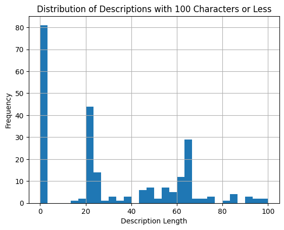

# 開発記録

## データセット作成

### タスク

* 入力：後藤研書籍リスト（加工済み）
* 出力：google books api経由で取得した情報を追加した書籍データフレーム

### 方法

* make_dataset.ipynbにて作成
  * utils.pyに格納されている検索用の関数を使用
  * ISBNが入力に含まれていないので，書籍名・著者名・出版社のうち2つ以上で検索
  * 入力の各行の本についてapiで情報取得→それぞれconcat
* dataset.csvとして保存

### 備考

* 検索に引っかからない場合
  * 同じワードで検索しても検索に引っかかる時とそうでない時がある（原因不明）
    * 5回同じ検索を行うことで対処
  * それでもなお検索できない20件は将来的に手動で対処
* descriptionがスカスカな場合
  * 検索できても，descriptionが空白/短い場合がある
  * ここも将来的に手動で対応することが望ましい
  * 
  * 
* 一応検索結果が間違ってる可能性もあり
  * 現状，特定ワードで検索したときのtop結果を取得しているため，それが違う場合はミスる
  * 将来的には人手で確認したいが，一旦放置で良さそう

## フロントエンド作成

* index.html
  * 検索部分
  * 複数条件について，AND検索とOR検索を切り替え可能
* results.html
  * 結果部分
  * クリックすると全体表示
* styles.css
  * 見た目部分

## バックエンド作成

* book_app.py

  * 複数条件についてAND検索とOR検索を実装（入力単語が含まれるか否かの検索）
  * | 入力窓     | 検索対象カラム |
    | ---------- | -------------- |
    | キーワード | description    |
    | タイトル   | title          |
    | 著者       | authors        |
    | 出版社     | publisher      |
* book_app_embedding.py

  * ベクトル検索を実装
    * 文章による検索ができるようになった（ベイズ統計の基礎的な本）
  * ベクトル化
    * 東北大BERT
  * アルゴリズム
    * 入力文をベクトル化
    * 各本のdescriptionのベクトルとのコサイン類似度を計算し，任意のtop_nのインデックスを取得
      * descriptionのベクトルはあらかじめ作成（make_embedding.ipynb）しておき，.npy形式で保存（本数 * 潜在次元数の行列）
    * 本データベースのうち取得したインデックスをresultsに渡して表示
* book_app_keyword_embedding

  * キーワード検索とベクトル検索を両方実装したもの
